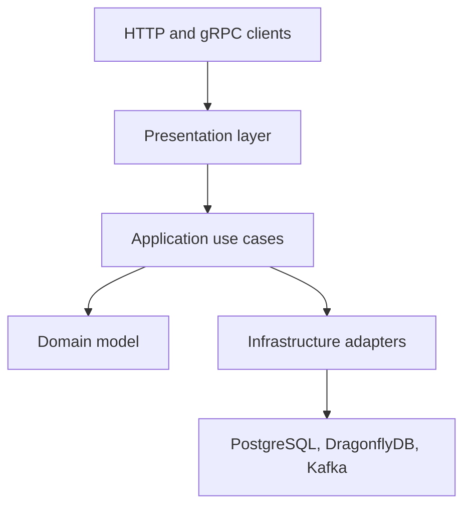

# Bank Service

A backend project written in Rust. It exposes HTTP and gRPC APIs for account operations and uses PostgreSQL, Kafka, and DragonflyDB.

> This project is for learning and demonstration purposes. It is not intended to process real money or be used as production banking software.

## Features

- Create and manage user accounts
- Deposit, withdraw, and transfer funds
- View account details and transaction history
- Apply idempotency keys to financial operations
- Store transaction events using the transactional outbox pattern
- Process external Kafka events
- Cache account data in DragonflyDB
- Retry selected database transaction failures
- Expose health checks and Prometheus metrics
- Send traces through OpenTelemetry
- Apply database migrations at startup

## Architecture



The workspace is split into five crates:

| Crate | Responsibility |
|---|---|
| `domain` | Account, owner, balance, transaction, and tier types |
| `application` | Use cases and ports |
| `infrastructure` | PostgreSQL repositories, Kafka, cache, settings, and observability |
| `presentation` | HTTP and gRPC APIs |
| `bootstraper` | Application startup and dependency wiring |

## Tech stack

- Rust and Tokio
- Axum for HTTP
- Tonic and Protocol Buffers for gRPC
- PostgreSQL and SQLx
- Redpanda for Kafka-compatible messaging
- DragonflyDB for caching
- Prometheus metrics, OpenTelemetry, and Sentry

## Run locally

Requirements: Docker Compose.

```bash
cp .env.example .env
docker compose up --build
```

The service applies database migrations on startup. The Compose stack also starts PostgreSQL, DragonflyDB, Redpanda, Prometheus, and Jaeger.

Before publishing, verify that the Prometheus configuration mounted by `docker-compose.yml` is committed to the repository. The provided `.gitignore` ignores `.docker/`, while Compose references `.docker/prometheus.yml`.

The values in `.env.example` are for local development only. Replace them for any non-local environment, and do not commit `.env`.

## Services and local ports

| Service | URL / port |
|---|---|
| HTTP API | `http://localhost:8080` |
| HTTP health check | `http://localhost:8080/health` |
| HTTP readiness check | `http://localhost:8080/ready` |
| Prometheus metrics | `http://localhost:9091/metrics` |
| gRPC API | `localhost:50051` |
| Jaeger UI | `http://localhost:16686` |
| PostgreSQL | `localhost:15432` |
| DragonflyDB | `localhost:6379` |
| Kafka-compatible broker | `localhost:9092` |

## HTTP API

HTTP account endpoints require a JWT in the `Authorization` header. The token's `sub` claim identifies the user.

| Method | Endpoint | Description |
|---|---|---|
| `POST` | `/accounts` | Create an account for the authenticated user |
| `GET` | `/accounts` | List accounts |
| `GET` | `/accounts/{account_number}` | Get an account |
| `POST` | `/accounts/{account_number}/deposit` | Deposit funds |
| `POST` | `/accounts/{account_number}/withdraw` | Withdraw funds |
| `POST` | `/transfers` | Transfer funds |
| `GET` | `/accounts/{account_number}/transactions` | Get transaction history |

Example account creation request, using a JWT issued for your local test user:

```bash
curl -X POST http://localhost:8080/accounts \
  -H "Authorization: Bearer <JWT>" \
  -H "Content-Type: application/json" \
  -d '{}'
```

A deposit request accepts an integer `amount` and an optional `idempotency_key`:

```bash
curl -X POST http://localhost:8080/accounts/<ACCOUNT_NUMBER>/deposit \
  -H "Authorization: Bearer <JWT>" \
  -H "Content-Type: application/json" \
  -d '{
    "amount": 100,
    "idempotency_key": "deposit-request-001"
  }'
```

The gRPC contract is defined in [`proto/bank.proto`](proto/bank.proto). gRPC requests are protected by the internal API key configured through `INTERNAL_API_KEY`.

## Run checks locally

```bash
cargo fmt --all -- --check
cargo clippy --workspace --all-targets -- -D warnings
cargo test --workspace
```

## Configuration

Runtime configuration is loaded from environment variables. See [`.env.example`](.env.example) for the available settings, including database, cache, server, Kafka, retry, telemetry, and authentication configuration.

## License

This project is licensed under the MIT License. See [`LICENSE`](LICENSE).
